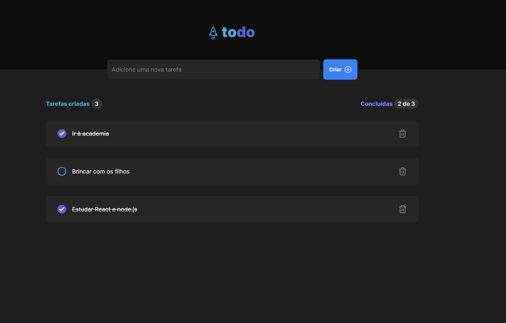

# TodoAPP - Challenge #1 Rocketseat

This is a solution to the Challenge #1 Rocketseat - ToDoApp. It's a React project aimed at improving my understanding of this framework.

## Table of contents

- [Overview](#overview)
  - [Screenshot](#screenshot)
  - [Links](#links)
- [My process](#my-process)
  - [Built with](#built-with)
  - [What I learned](#what-i-learned)
  - [Continued development](#continued-development)
  - [Useful resources](#useful-resources)
- [Author](#author)
- [Acknowledgments](#acknowledgments)

## Overview

### Screenshot



### Links

- Solution URL: [Github](https://github.com/danilo-marra/todoapp)
- Live Site URL: [Vercel](https://todoapp-lilac-two.vercel.app/)
- Course: [Rocketseat](https://app.rocketseat.com.br/)

## My process

### Built with

- Semantic HTML5 markup
- Flexbox
- CSS Grid
- Mobile-first workflow
- Typescript
- [React](https://reactjs.org/) - JS library
- [Vite.js](https://vitejs.dev/) - React framework
- [Tailwind](https://tailwindcss.com/docs/flex/) - CSS framework

### What I learned

I learned how to use components, props, and hooks on a efficiently and productively way, following clean code principles. I also learned how to use map and filter methods on arrays and how to use Tailwind CSS.

### Using map()

```tsx
{
  tasks.map((task) => {
    return (
      <ContentTask
        key={task.id}
        task={task}
        tasks={tasks}
        setTasks={setTasks}
      />
    );
  });
}
```

### Using filter()

```tsx
function handleDeleteTask(taskToDelete: string) {
  const tasksWithoutDeletedOne = tasks.filter(
    (task) => task.id !== taskToDelete,
  );
  setTasks(tasksWithoutDeletedOne);
}
```

### Using Tailwind properties to adapt to screens

```css
      <section className="mt-[7rem] max-w-full sm:max-w-screen-sm lg:max-w-screen-lg mx-auto lg:mt-20 flex justify-between items-center font-bold">
        <CreatedTasks
          tasks={tasks}
        />
        <DoneTasks
          tasks={tasks}
          totalCompletedTasks={tasks.filter(task => task.isComplete).length}
        />
      </section>
```

### Continued development

I still need to learn more about other JavaScript methods and how to use JSON to fetch data for my apps.

### Useful resources

- [JS documentation](https://developer.mozilla.org/) - For understanding better about array methods
- [Tailwind documentation](https://tailwindcss.com/) - On how adjust size of screens in my app
- [Chat GPT](https://chat.openai.com/) - Help me to undersstand some concepts of React.js and Typescript as a whole

## Author

- Website - [Danilo Marra Rabelo](https://github.com/danilo-marra)
- Twitter / X- [https://twitter.com/danniloweb](https://twitter.com/danniloweb)

## Acknowledgments

Never give up and push yourself to learn more every day.
